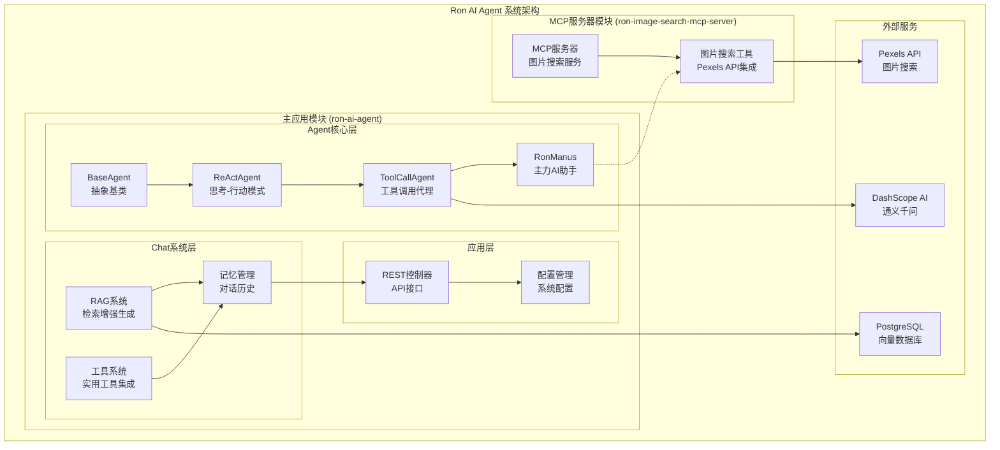
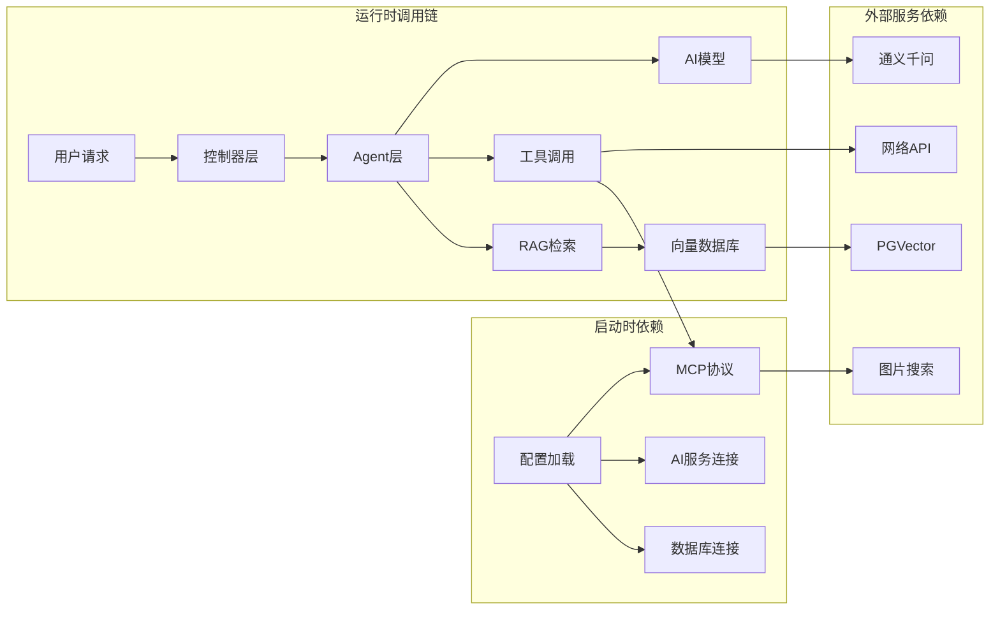
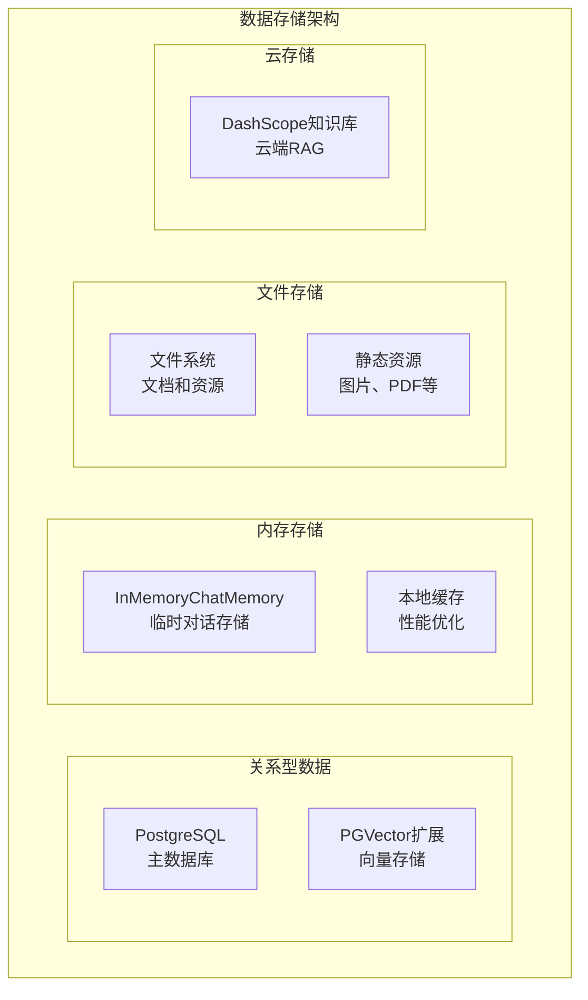
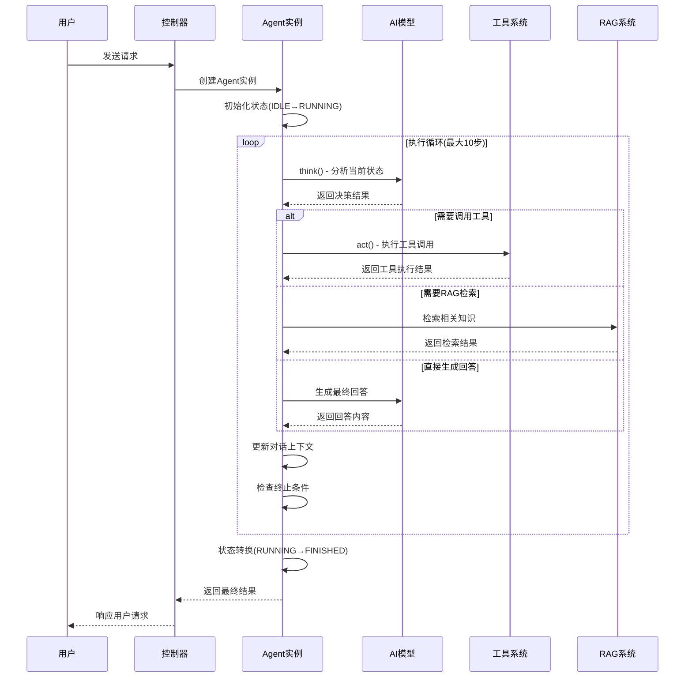
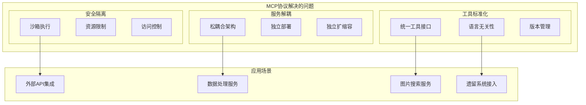
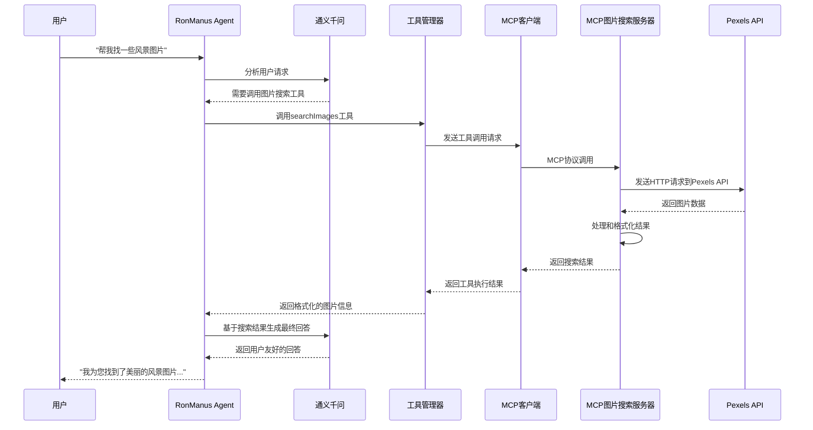

# Ron AI Agent 项目技术深度解析报告

## 1. 项目整体架构

### 1.1 模块化分解



### 核心模块职责分析

#### Agent核心模块
- **BaseAgent**: 提供Agent抽象基类，实现生命周期管理、状态控制、消息管理
- **ReActAgent**: 实现思考-行动循环模式，提供智能决策框架
- **ToolCallAgent**: 集成Spring AI工具回调系统，支持函数调用机制
- **RonManus**: 主要AI代理实现，预配置系统提示词和工具集

#### Chat系统模块
- **RAG系统**: 实现文档检索、向量化存储、查询增强等功能
- **记忆管理**: 管理对话历史，支持长期记忆和短期记忆
- **工具系统**: 集成文件操作、网络搜索、PDF生成等实用工具

#### MCP服务器模块
- **独立服务**: 作为独立的Spring Boot应用运行
- **图片搜索**: 专门提供图片搜索功能
- **协议支持**: 基于MCP协议提供标准化工具接口

### 1.2 依赖关系分析



### 调用链路详细分析

1. **启动阶段**: 配置文件加载 → 数据库连接建立 → AI服务初始化 → MCP服务器启动
2. **请求处理**: HTTP请求 → 控制器路由 → Agent实例化 → 工具调用链 → 结果返回
3. **RAG检索**: 文档加载 → 向量化 → 相似度计算 → 上下文融合 → 生成回答
4. **MCP通信**: 工具识别 → MCP连接 → 协议通信 → 结果处理

### 1.3 配置管理分析

#### 核心配置项详解

**application.yml** - 基础配置
```yaml
spring:
  ai:
    vectorstore:
      pgvector:
        index-type: HNSW              # HNSW索引算法，提高检索效率
        dimensions: 1536               # DashScope嵌入模型维度
        distance-type: COSINE_DISTANCE # 余弦相似度计算
        max-document-batch-size: 10000 # 批处理大小限制
    mcp:
      client:
        stdio:
          servers-configuration: classpath:mcp-servers.json
```

**application-local.yml** - 敏感信息配置
```yaml
spring:
  ai:
    dashscope:
      api-key: xxxxxx  # 通义千问API密钥
  datasource:
    url: jdbc:postgresql://.../ron_ai_agent          # PostgreSQL连接
    username: xxx
    password: xxxxx
  search-api:
    api-key: xxxxxxx               # 搜索API密钥
```

**mcp-servers.json** - MCP服务器配置
```json
{
  "mcpServers": {
    "ron-image-search-mcp-server": {
      "command": "java",
      "args": [
        "-Dspring.ai.mcp.server.stdio=true",
        "-jar", "ron-image-search-mcp-server-0.0.1-SNAPSHOT.jar"
      ]
    }
  }
}
```

## 2. 核心技术栈与选型分析

### 2.1 框架与库选型

#### 核心技术栈
```java
// 主要框架版本
Spring Boot: 3.5.5          // 企业级应用框架
Java: 21                    // 最新LTS版本，支持虚拟线程
Spring AI: 1.0.2           // AI集成框架
Spring AI Alibaba: 1.0.0-M2.1  // 阿里云AI集成
```

#### 关键依赖库分析

| 库名称 | 版本 | 用途 | 技术优势 |
|--------|------|------|----------|
| `dashscope-sdk-java` | 2.21.5 | 阿里云AI服务 | 官方支持，功能完整 |
| `langchain4j-community-dashscope` | 1.3.0-beta9 | LangChain集成 | 社区活跃，扩展性强 |
| `spring-ai-pgvector-store` | 1.0.2 | 向量数据库 | 高性能向量检索 |
| `hutool-all` | 5.8.38 | 工具库 | 简化开发，提高效率 |
| `jsoup` | 1.21.2 | HTML解析 | 轻量级，功能强大 |
| `itext-core` | 9.1.0 | PDF生成 | 企业级文档处理 |

### 2.2 AI模型集成

#### DashScope集成方案
```java
@Configuration
public class DashScopeConfig {
    @Bean
    public ChatModel dashScopeChatModel() {
        return DashScopeChatModel.builder()
                .apiKey(System.getenv("DASHSCOPE_API_KEY"))
                .model("qwen-plus")  // 通义千问Plus模型
                .build();
    }

    @Bean
    public EmbeddingModel dashscopeEmbeddingModel() {
        return DashScopeEmbeddingModel.builder()
                .apiKey(System.getenv("DASHSCOPE_API_KEY"))
                .model("text-embedding-v1")  // 文本嵌入模型
                .build();
    }
}
```

**模型切换机制**:
- 通过Spring配置实现模型热切换
- 支持多模型并行部署和A/B测试
- 统一的ChatClient接口屏蔽底层差异

### 2.3 数据存储架构

#### 存储系统设计


**存储策略**:
- **PostgreSQL**: 结构化数据、向量存储、会话持久化
- **内存存储**: 对话上下文、缓存热点数据
- **文件系统**: 文档资源、生成文件存储
- **云端知识库**: 大规模知识库检索

## 3. Agent核心架构设计（重点章节）

### 3.1 核心组件剖析

#### BaseAgent - 统一执行框架
```java
public abstract class BaseAgent {
    // 状态管理
    private AgentState agentState = AgentState.IDLE;
    private List<Message> messages = new ArrayList<>();
    private int currentStep = 0;
    private int maxSteps = 10;

    // 核心执行方法
    public String run(String userPrompt) {
        validateState();
        agentState = AgentState.RUNNING;
        messages.add(new UserMessage(userPrompt));

        while (shouldContinue()) {
            String stepResult = step();
            processStepResult(stepResult);
            currentStep++;
        }

        return finalizeExecution();
    }

    // 流式执行支持
    public SseEmitter runStream(String userPrompt) {
        SseEmitter emitter = new SseEmitter(180000L);
        CompletableFuture.runAsync(() -> executeStream(emitter, userPrompt));
        return emitter;
    }
}
```

**设计特点**:
- **状态机模式**: 清晰的状态转换逻辑
- **模板方法**: 定义执行流程骨架，子类实现具体步骤
- **异步支持**: 同时支持同步和流式异步执行

#### ReActAgent - 智能决策循环
```java
public abstract class ReActAgent extends BaseAgent {
    @Override
    public final String step() {
        try {
            // 思考阶段：分析当前状态，决定行动
            boolean shouldAct = think();
            if (!shouldAct) {
                return "思考完成，无需进一步行动";
            }

            // 行动阶段：执行具体操作
            return act();

        } catch (Exception e) {
            handleError(e);
            return "步骤执行失败: " + e.getMessage();
        }
    }

    // 抽象方法供子类实现
    protected abstract boolean think();
    protected abstract String act();
}
```

**ReAct模式优势**:
- **智能决策**: 每步都进行理性分析
- **灵活适应**: 根据执行结果动态调整策略
- **可控性强**: 支持人工干预和终止

### 3.2 生命周期与执行流程

#### 完整执行流程图


### 3.3 工具调用机制深度解析

#### Spring AI Function Calling实现
```java
@Configuration
public class ToolRegistration {
    @Bean
    public ToolCallback[] allTools(
            FileOperationTool fileOperationTool,
            WebSearchTool webSearchTool,
            TerminateTool terminateTool) {

        return ToolCallbacks.from(
            fileOperationTool,
            webSearchTool,
            terminateTool
        );
    }
}
```

#### 自定义工具实现示例
```java
@Component
public class WebSearchTool {
    private static final String SEARCH_API_URL = "https://api.serper.dev/search";

    @Tool(description = "从搜索引擎获取信息")
    public String searchWeb(
            @ToolParam(description = "搜索关键词") String query,
            @ToolParam(description = "结果数量限制，默认10") @DefaultValue("10") int limit) {

        try {
            Map<String, Object> params = Map.of(
                "q", query,
                "num", limit
            );

            String response = HttpUtil.get(SEARCH_API_URL, params);
            return processSearchResults(response);

        } catch (Exception e) {
            log.error("搜索失败: {}", e.getMessage());
            return "搜索执行失败: " + e.getMessage();
        }
    }

    private String processSearchResults(String jsonResponse) {
        // 解析JSON响应，提取搜索结果
        JSONArray results = JSONUtil.parseObj(jsonResponse)
                .getJSONArray("organic");

        return results.stream()
                .map(obj -> (JSONObject) obj)
                .map(result -> String.format("%s: %s",
                        result.getStr("title"),
                        result.getStr("snippet")))
                .collect(Collectors.joining("\n"));
    }
}
```

#### 工具调用工作原理
1. **工具注册**: Spring Boot启动时自动发现带有`@Tool`注解的方法
2. **Schema生成**: 自动生成工具的JSON Schema描述
3. **LLM分析**: 大模型根据用户请求和工具描述选择合适的工具
4. **参数映射**: 将用户输入转换为工具方法参数
5. **执行调用**: 通过反射机制执行工具方法
6. **结果处理**: 将工具返回值转换为LLM可理解的格式

### 3.4 记忆管理系统

#### 多层次记忆架构
```java
@Component
public class HierarchicalChatMemory implements ChatMemory {
    private final ChatMemory shortTermMemory;   // 短期记忆(当前会话)
    private final ChatMemory longTermMemory;     // 长期记忆(历史会话)
    private final int maxShortTermSize = 50;     // 短期记忆容量限制

    @Override
    public void add(String conversationId, List<Message> messages) {
        // 添加到短期记忆
        shortTermMemory.add(conversationId, messages);

        // 检查是否需要归档到长期记忆
        List<Message> currentMessages = shortTermMemory.get(conversationId, 1000);
        if (currentMessages.size() > maxShortTermSize) {
            archiveToLongTerm(conversationId, currentMessages);
        }
    }

    private void archiveToLongTerm(String conversationId, List<Message> messages) {
        // 提取关键信息进行压缩存储
        List<Message> compressedMessages = compressMessages(messages);
        longTermMemory.add(conversationId, compressedMessages);

        // 清理短期记忆
        List<Message> recentMessages = messages.subList(
            messages.size() - maxShortTermSize, messages.size());
        shortTermMemory.clear(conversationId);
        shortTermMemory.add(conversationId, recentMessages);
    }
}
```

**记忆管理策略**:
- **短期记忆**: 保持最近50轮对话，确保上下文连贯性
- **长期记忆**: 压缩存储历史会话的关键信息
- **记忆压缩**: 使用AI总结和提炼重要信息
- **记忆检索**: 根据相关性检索历史记忆

## 4. RAG（检索增强生成）实现详解

### 4.1 文档处理流水线

#### 高级文档加载器
```java
@Component
public class AdvancedDocumentLoader {
    private final DocumentParser parser;
    private final TextCleaner cleaner;
    private final MetadataExtractor extractor;

    public List<Document> loadAndProcessDocuments(String pathPattern) {
        List<Document> documents = new ArrayList<>();

        // 1. 文档发现
        List<Resource> resources = discoverDocuments(pathPattern);

        for (Resource resource : resources) {
            try {
                // 2. 原始内容解析
                String rawContent = parseDocument(resource);

                // 3. 文本清洗和预处理
                String cleanedContent = cleaner.clean(rawContent);

                // 4. 智能分块
                List<TextChunk> chunks = intelligentChunking(cleanedContent);

                // 5. 元数据提取和增强
                Map<String, Object> metadata = extractor.extract(resource, cleanedContent);

                // 6. 创建文档对象
                for (TextChunk chunk : chunks) {
                    Document doc = new Document(chunk.getText(), metadata);
                    documents.add(doc);
                }

            } catch (Exception e) {
                log.error("处理文档失败: {}", resource.getFilename(), e);
            }
        }

        return documents;
    }

    private List<TextChunk> intelligentChunking(String content) {
        // 基于语义边界的智能分块
        List<TextChunk> chunks = new ArrayList<>();

        // 使用重叠窗口分块，保持语义连续性
        int chunkSize = 500;      // 每块大小
        int overlap = 100;        // 重叠大小

        List<String> sentences = splitIntoSentences(content);
        StringBuilder currentChunk = new StringBuilder();

        for (String sentence : sentences) {
            if (currentChunk.length() + sentence.length() > chunkSize) {
                if (currentChunk.length() > 0) {
                    chunks.add(new TextChunk(currentChunk.toString()));
                    // 保留重叠部分
                    currentChunk = new StringBuilder(extractOverlap(currentChunk.toString(), overlap));
                }
            }
            currentChunk.append(sentence).append(" ");
        }

        if (currentChunk.length() > 0) {
            chunks.add(new TextChunk(currentChunk.toString()));
        }

        return chunks;
    }
}
```

### 4.2 向量化与存储机制

#### 高性能向量存储配置
```java
@Configuration
public class OptimizedVectorStoreConfig {

    @Bean
    @Primary
    public VectorStore optimizedPgVectorStore(
            JdbcTemplate jdbcTemplate,
            EmbeddingModel embeddingModel) {

        return PgVectorStore.builder(jdbcTemplate, embeddingModel)
                .dimensions(1536)                    // DashScope模型维度
                .distanceType(COSINE_DISTANCE)       // 余弦相似度
                .indexType(HNSW)                     // 高性能索引算法
                .indexParameters(Map.of(
                    "m", 16,                          // HNSW连接数
                    "ef_construction", 64             // 构建时的搜索范围
                ))
                .initializeSchema(true)
                .schemaName("public")
                .vectorTableName("optimized_vector_store")
                .maxDocumentBatchSize(50)             // 优化批处理大小
                .embeddingStorageType(JSONB)          // 使用JSONB存储向量
                .build();
    }

    @Bean
    public VectorStoreIndexer vectorStoreIndexer(VectorStore vectorStore) {
        return VectorStoreIndexer.builder()
                .vectorStore(vectorStore)
                .batchSize(50)
                .maxRetries(3)
                .retryDelay(Duration.ofSeconds(2))
                .build();
    }
}
```

#### 向量化性能优化
```java
@Component
public class BatchEmbeddingService {
    private final EmbeddingModel embeddingModel;
    private final RateLimiter rateLimiter = RateLimiter.create(10); // 限制QPS

    @Async("embeddingExecutor")
    public CompletableFuture<List<Embedding>> embedBatch(List<String> texts) {
        return CompletableFuture.supplyAsync(() -> {
            try {
                // 速率限制
                rateLimiter.acquire();

                // 批量嵌入
                return embeddingModel.embed(texts);

            } catch (Exception e) {
                log.error("批量嵌入失败", e);
                throw new RuntimeException("嵌入服务异常", e);
            }
        });
    }
}
```

### 4.3 检索与融合策略

#### 混合检索策略
```java
@Component
public class HybridRetrievalStrategy {
    private final VectorStore vectorStore;
    private final KeywordRetriever keywordRetriever;
    private final FusionStrategy fusionStrategy;

    public List<Document> retrieve(Query query, RetrievalOptions options) {
        // 1. 向量检索
        List<ScoredDocument> vectorResults = vectorStore.similaritySearch(
            SearchRequest.query(query.text())
                .withTopK(options.topK())
                .withSimilarityThreshold(options.similarityThreshold())
        );

        // 2. 关键词检索
        List<ScoredDocument> keywordResults = keywordRetriever.search(
            query, options.topK());

        // 3. 结果融合
        return fusionStrategy.fuse(vectorResults, keywordResults, options);
    }
}

@Component
public class ReciprocalRankFusion implements FusionStrategy {

    @Override
    public List<Document> fuse(
            List<ScoredDocument> vectorResults,
            List<ScoredDocument> keywordResults,
            RetrievalOptions options) {

        Map<String, Double> fusedScores = new HashMap<>();
        Map<String, Document> documentMap = new HashMap<>();

        // RRF融合算法
        int k = 60; // RRF常数

        // 融合向量检索结果
        fuseResults(vectorResults, fusedScores, documentMap, k);

        // 融合关键词检索结果
        fuseResults(keywordResults, fusedScores, documentMap, k);

        // 排序并返回Top-K结果
        return fusedScores.entrySet().stream()
                .sorted(Map.Entry.<String, Double>comparingByValue().reversed())
                .limit(options.topK())
                .map(entry -> documentMap.get(entry.getKey()))
                .collect(Collectors.toList());
    }

    private void fuseResults(
            List<ScoredDocument> results,
            Map<String, Double> fusedScores,
            Map<String, Document> documentMap,
            int k) {

        for (int i = 0; i < results.size(); i++) {
            ScoredDocument scoredDoc = results.get(i);
            String docId = scoredDoc.getDocument().getId();

            double rrfScore = 1.0 / (k + i + 1);
            fusedScores.merge(docId, rrfScore, Double::sum);
            documentMap.put(docId, scoredDoc.getDocument());
        }
    }
}
```

#### 上下文增强生成
```java
@Component
public class ContextualAugmentationService {
    private final ChatModel chatModel;
    private final PromptTemplate augmentationTemplate;

    public String augmentAndGenerate(String query, List<Document> context) {
        // 1. 上下文排序和过滤
        List<Document> relevantContext = filterAndRankContext(query, context);

        // 2. 上下文压缩
        String compressedContext = compressContext(relevantContext);

        // 3. 构建增强提示
        Map<String, Object> variables = Map.of(
            "context", compressedContext,
            "query", query,
            "context_count", relevantContext.size()
        );

        Prompt prompt = augmentationTemplate.create(variables);

        // 4. 生成回答
        return chatModel.call(prompt).getResult().getOutput().getText();
    }

    private String compressContext(List<Document> context) {
        // 使用AI模型压缩上下文，保留关键信息
        String contextText = context.stream()
                .map(Document::getText)
                .collect(Collectors.joining("\n\n"));

        if (contextText.length() > 4000) {
            // 使用大模型进行智能摘要
            return summarizeContext(contextText);
        }

        return contextText;
    }
}
```

## 5. MCP（模型上下文协议）集成分析

### 5.1 集成目的与场景

#### MCP协议优势


### 5.2 实现细节深度解析

#### MCP服务器完整实现
```java
@SpringBootApplication
public class RonImageSearchMcpServerApplication {

    public static void main(String[] args) {
        // 配置MCP服务器运行模式
        System.setProperty("spring.ai.mcp.server.stdio", "true");
        System.setProperty("spring.main.web-application-type", "none");
        System.setProperty("logging.pattern.console", "");

        SpringApplication.run(RonImageSearchMcpServerApplication.class, args);
    }

    @Bean
    public ToolCallbackProvider imageSearchTools(
            ImageSearchTool imageSearchTool,
            ImageDownloadTool imageDownloadTool) {

        return MethodToolCallbackProvider.builder()
                .toolObjects(imageSearchTool, imageDownloadTool)
                .build();
    }

    @Bean
    public McpServerProperties mcpServerProperties() {
        McpServerProperties properties = new McpServerProperties();
        properties.setName("ron-image-search-server");
        properties.setVersion("1.0.0");
        return properties;
    }
}

@Service
@Slf4j
public class ImageSearchTool {
    private static final String PEXELS_API_KEY = "YOUR_PEXELS_API_KEY";
    private static final String PEXELS_API_URL = "https://api.pexels.com/v1/search";
    private final RestTemplate restTemplate;
    private final Cache<String, SearchResult> cache;

    public ImageSearchTool(RestTemplate restTemplate, CacheManager cacheManager) {
        this.restTemplate = restTemplate;
        this.cache = cacheManager.getCache("imageSearch");
    }

    @Tool(description = "从Pexels图片库搜索高质量图片")
    public String searchImages(
            @ToolParam(description = "搜索关键词") String query,
            @ToolParam(description = "每页结果数量，默认20") @DefaultValue("20") int perPage,
            @ToolParam(description = "图片方向：landscape、portrait或square") @DefaultValue("landscape") String orientation) {

        try {
            // 缓存检查
            String cacheKey = String.format("%s_%d_%s", query, perPage, orientation);
            SearchResult cachedResult = cache.get(cacheKey);
            if (cachedResult != null) {
                return formatSearchResult(cachedResult);
            }

            // 构建请求
            HttpHeaders headers = new HttpHeaders();
            headers.setBearerAuth(PEXELS_API_KEY);
            headers.setContentType(MediaType.APPLICATION_JSON);

            UriComponentsBuilder builder = UriComponentsBuilder
                    .fromUriString(PEXELS_API_URL)
                    .queryParam("query", query)
                    .queryParam("per_page", Math.min(perPage, 80)) // Pexels限制
                    .queryParam("orientation", orientation);

            HttpEntity<?> entity = new HttpEntity<>(headers);

            // 发送请求
            ResponseEntity<PexelsResponse> response = restTemplate.exchange(
                    builder.build().toUri(),
                    HttpMethod.GET,
                    entity,
                    PexelsResponse.class);

            if (response.getStatusCode() == HttpStatus.OK && response.getBody() != null) {
                SearchResult searchResult = processResponse(response.getBody());

                // 缓存结果（5分钟过期）
                cache.put(cacheKey, searchResult);

                return formatSearchResult(searchResult);
            } else {
                return "图片搜索失败：API返回错误状态码 " + response.getStatusCode();
            }

        } catch (Exception e) {
            log.error("图片搜索异常", e);
            return "图片搜索失败：" + e.getMessage();
        }
    }

    private SearchResult processResponse(PexelsResponse response) {
        List<ImageInfo> images = response.getPhotos().stream()
                .map(this::convertToImageInfo)
                .collect(Collectors.toList());

        return new SearchResult(images, response.getTotalResults());
    }

    private ImageInfo convertToImageInfo(PexelsPhoto photo) {
        return ImageInfo.builder()
                .id(photo.getId())
                .url(photo.getSrc().getMedium())
                .photographer(photo.getPhotographer())
                .photographerUrl(photo.getPhotographerUrl())
                .width(photo.getWidth())
                .height(photo.getHeight())
                .build();
    }

    private String formatSearchResult(SearchResult result) {
        StringBuilder sb = new StringBuilder();
        sb.append("找到 ").append(result.getTotalCount()).append(" 张相关图片：\n\n");

        result.getImages().stream()
                .limit(5) // 只返回前5张图片的详细信息
                .forEach(img -> {
                    sb.append(String.format("📷 %s\n", img.getUrl()));
                    sb.append(String.format("   摄影： %s\n", img.getPhotographer()));
                    sb.append(String.format("   尺寸： %dx%d\n\n", img.getWidth(), img.getHeight()));
                });

        if (result.getImages().size() > 5) {
            sb.append(String.format("... 还有 %d 张图片\n", result.getImages().size() - 5));
        }

        return sb.toString();
    }
}
```

#### MCP客户端集成
```java
@Configuration
public class McpClientConfiguration {

    @Bean
    public McpClient mcpClient() {
        return McpClient.builder()
                .serverConfigurations(loadServerConfigurations())
                .build();
    }

    private Map<String, McpServerConfiguration> loadServerConfigurations() {
        try {
            Resource resource = new ClassPathResource("mcp-servers.json");
            String configContent = StreamUtils.copyToString(
                    resource.getInputStream(), StandardCharsets.UTF_8);

            return JsonMapper.builder().build()
                    .readValue(configContent,
                            new TypeReference<Map<String, McpServerConfiguration>>() {});

        } catch (Exception e) {
            log.error("加载MCP服务器配置失败", e);
            return Collections.emptyMap();
        }
    }
}

@Component
public class McpToolManager {
    private final McpClient mcpClient;
    private final Map<String, McpToolWrapper> availableTools = new ConcurrentHashMap<>();

    @PostConstruct
    public void initializeTools() {
        // 启动时连接所有MCP服务器并发现工具
        mcpClient.listTools().forEach(tool -> {
            availableTools.put(tool.name(), new McpToolWrapper(tool));
            log.info("发现MCP工具： {} - {}", tool.name(), tool.description());
        });
    }

    public List<ToolCallback> getToolCallbacks() {
        return availableTools.values().stream()
                .map(McpToolWrapper::toToolCallback)
                .collect(Collectors.toList());
    }

    public String executeTool(String toolName, Map<String, Object> arguments) {
        McpToolWrapper tool = availableTools.get(toolName);
        if (tool == null) {
            throw new IllegalArgumentException("未找到工具：" + toolName);
        }

        return tool.execute(arguments);
    }
}
```

### 5.3 交互流程示例

#### Agent通过MCP调用图片搜索的完整流程


## 6. 关键设计决策与权衡

### 6.1 设计亮点

#### 1. 分层Agent架构设计
**优势**:
- **职责清晰**: 每层Agent专注特定功能，便于维护和扩展
- **复用性强**: 基础层可被多个上层Agent复用
- **测试友好**: 每层可独立测试，提高代码质量

**实现亮点**:
```java
// 清晰的继承层次和职责分离
BaseAgent (生命周期管理)
    ↓
ReActAgent (思考-行动循环)
    ↓
ToolCallAgent (工具调用集成)
    ↓
RonManus (具体业务实现)
```

#### 2. 多存储策略的RAG实现
**创新点**:
- **混合存储**: 本地内存 + PostgreSQL持久化 + 云端知识库
- **智能路由**: 根据数据特性选择最优存储策略
- **性能优化**: 分批处理、异步嵌入、缓存机制

#### 3. MCP协议的标准化集成
**技术优势**:
- **工具生态标准化**: 统一的工具接口和调用协议
- **服务解耦**: 工具服务独立部署和扩展
- **安全隔离**: 沙箱执行和资源控制

### 6.2 潜在问题与改进建议

#### 1. 性能瓶颈识别

**问题**: 向量嵌入API调用频率限制
```java
// 当前实现存在的问题
public void embedDocuments(List<Document> documents) {
    for (Document doc : documents) {
        // 逐个调用API，容易触发速率限制
        Embedding embedding = embeddingModel.embed(doc.getText());
        // 处理结果...
    }
}
```

**改进方案**:
```java
@Component
public class OptimizedEmbeddingService {
    private final EmbeddingModel embeddingModel;
    private final ThreadPoolExecutor executor;
    private final Semaphore rateLimiter;

    public CompletableFuture<List<Embedding>> embedAsync(
            List<String> texts) {

        return CompletableFuture.supplyAsync(() -> {
            List<Embedding> embeddings = new ArrayList<>();

            // 分批处理，控制并发数
            int batchSize = 10;
            List<List<String>> batches = Lists.partition(texts, batchSize);

            for (List<String> batch : batches) {
                try {
                    // 速率限制
                    rateLimiter.acquire();

                    // 批量嵌入
                    List<Embedding> batchEmbeddings = embeddingModel.embed(batch);
                    embeddings.addAll(batchEmbeddings);

                } catch (Exception e) {
                    log.error("批量嵌入失败", e);
                    // 实现重试机制
                    retryWithBackoff(batch);
                }
            }

            return embeddings;
        }, executor);
    }
}
```

#### 2. 内存管理优化

**问题**: 大量对话历史导致内存泄漏
```java
// 改进后的记忆管理
@Component
public class MemoryManagedChatMemory implements ChatMemory {
    private final Cache<String, ConversationSession> sessionCache;
    private final MemoryMonitor memoryMonitor;

    @Scheduled(fixedRate = 300000) // 每5分钟检查一次
    public void performMemoryCleanup() {
        // 1. 检查内存使用情况
        MemoryUsage memoryUsage = memoryMonitor.getCurrentUsage();

        if (memoryUsage.getUsagePercentage() > 80) {
            // 2. 清理过期会话
            cleanupExpiredSessions();

            // 3. 压缩长期存储的记忆
            compressLongTermMemory();

            // 4. 强制垃圾回收
            System.gc();
        }
    }

    private void cleanupExpiredSessions() {
        sessionCache.invalidateAll(session -> {
            ConversationSession session = sessionCache.getIfPresent(session);
            return session != null &&
                   session.getLastAccessTime().isBefore(
                       Instant.now().minus(Duration.ofHours(24)));
        });
    }
}
```

#### 3. 错误处理和容错机制

**改进建议**:
```java
@Component
public class ResilientToolExecutor {
    private final CircuitBreaker circuitBreaker;
    private final Retry retry;
    private final RateLimiter rateLimiter;

    public String executeToolWithResilience(
            String toolName,
            Map<String, Object> arguments) {

        Supplier<String> toolExecution = () -> {
            // 速率限制
            rateLimiter.acquire();
            return executeTool(toolName, arguments);
        };

        // 熔断器保护
        Supplier<String> protectedExecution =
                CircuitBreaker.decorateSupplier(circuitBreaker, toolExecution);

        // 重试机制
        Supplier<String> retriableExecution =
                Retry.decorateSupplier(retry, protectedExecution);

        try {
            return retriableExecution.get();
        } catch (Exception e) {
            log.error("工具执行失败：{}", toolName, e);
            return getFallbackResponse(toolName, e);
        }
    }

    private String getFallbackResponse(String toolName, Exception e) {
        // 智能降级策略
        if (e instanceof TimeoutException) {
            return String.format("工具 %s 执行超时，请稍后重试", toolName);
        } else if (e instanceof RateLimitException) {
            return String.format("工具 %s 调用频率过高，请稍后重试", toolName);
        } else {
            return String.format("工具 %s 暂时不可用，已记录错误信息", toolName);
        }
    }
}
```

#### 4. 监控和可观测性

**建议添加**:
```java
@Component
public class AgentMetrics {
    private final MeterRegistry meterRegistry;
    private final Timer executionTimer;
    private final Counter successCounter;
    private final Counter errorCounter;

    public AgentMetrics(MeterRegistry meterRegistry) {
        this.meterRegistry = meterRegistry;
        this.executionTimer = Timer.builder("agent.execution.time")
                .description("Agent执行时间")
                .register(meterRegistry);
        this.successCounter = Counter.builder("agent.execution.success")
                .description("Agent成功执行次数")
                .register(meterRegistry);
        this.errorCounter = Counter.builder("agent.execution.error")
                .description("Agent执行错误次数")
                .register(meterRegistry);
    }

    public <T> T recordExecution(String operationName, Supplier<T> operation) {
        return Timer.Sample.start(meterRegistry)
                .stop(executionTimer)
                .recordCallable(() -> {
                    try {
                        T result = operation.get();
                        successCounter.increment(Tags.of("operation", operationName));
                        return result;
                    } catch (Exception e) {
                        errorCounter.increment(Tags.of("operation", operationName, "error", e.getClass().getSimpleName()));
                        throw e;
                    }
                });
    }
}
```

### 6.3 架构演进建议

#### 短期优化（1-3个月）
1. **性能优化**: 实现异步嵌入和批量处理
2. **缓存策略**: 添加多级缓存机制
3. **错误处理**: 完善熔断和重试机制
4. **监控告警**: 添加完整的监控体系

#### 中期演进（3-6个月）
1. **微服务化**: 将MCP服务器进一步拆分为独立的微服务
2. **多模型支持**: 集成更多AI模型，支持模型路由
3. **知识图谱**: 构建领域知识图谱，提升RAG效果
4. **多租户支持**: 支持企业级的多租户部署

#### 长期规划（6-12个月）
1. **分布式Agent**: 支持Agent集群和分布式执行
2. **AutoML能力**: 自动优化Agent参数和工具选择
3. **边缘计算**: 支持边缘设备部署和离线执行
4. **联邦学习**: 支持跨组织的知识共享和模型训练

## 总结

`ron-ai-agent`项目展现了现代AI应用开发的最佳实践，通过分层架构、RAG技术、MCP协议等先进技术，构建了一个功能完整、性能优异的智能助手系统。项目在架构设计、技术选型、实现细节等方面都有诸多亮点，为企业级AI应用提供了宝贵的技术参考。

通过持续的优化和演进，该系统有望成为下一代AI应用的标杆实现，推动AI技术在更多领域的落地和应用。